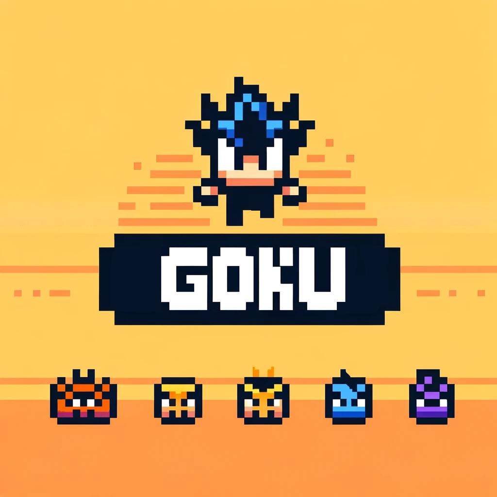

# Goku Engine

<p align="center">
    
</p>


[](https://github.com/ladroid/goku)
[](https://lados-organization.gitbook.io/goku/)


[ [English](README.md) | [Deutsch](docs/README.de.md) | [Español](docs/README.es.md) | [Français](docs/README.fr.md) | [日本語](docs/README.ja.md) ]


Goku is a 2D game development application for Rust (in the future integration with 3D games). Written purely in Rust. 

It’s available for **macOS**, **Windows** and **Linux**.

Based on SDL2 (currently).

Goku is focused, lightweight and has few dependencies (mostly SDL2). It provides:

* a window and a main loop

* 2D graphics and text

* sounds and music

* keyboard, mouse, and gamepad input

* GUI interface for development

<ins>third party libraries which used Goku currently:</ins>

* SDL2

* nalgebra

* imgui

* serde

* rfd

* glow

* webbrowser

## How to use

**IMPORTANT!!!**

* A quick overview is located here -> [Goku Engine](https://gokuengine.com/)
* The documentation is located here -> [Gitbook](https://lados-organization.gitbook.io/goku/)
* A development blog that covers our progress, plans and shiny new features is located here -> [News](https://gokuengine.com/news)
* All examples are located here -> [Official Examples](https://github.com/ladroid/goku/tree/main/examples)

## Requirements
### Linux
Install these through your favourite package management tool, or via
http://www.libsdl.org/

**Ubuntu example:**
> sudo apt-get install libsdl2-dev

**Fedora example:**
> sudo dnf install SDL2-devel

**Arch example:**
(Arch doesn't have separate regular and development packages, everything goes together.)  
> sudo pacman -S sdl2

You might also need a C compiler (`gcc`).

#### Static linking in Linux

You can choose to link SDL2 statically instead of dynamically with the `static-link` feature.
On Linux, you will need to additionally do one of the following:
* use the `bundled` feature
* use the feature `use-pkgconfig` so that rustc knows where to look for your SDL2 libraries and its dependencies for static linking. This is required because there is no built-in way to find the resources needed to link statically SDL2 from your system
* install development libraries with [vcpkg][vcpkg]. Instructions to generate a static binary on Linux and other operating systems using vcpkg are [here][cargo-vcpkg-usage]

### macOS
#### Homebrew
On macOS, it's a good idea to install these via
[homebrew][homebrew].

```
brew install sdl2
```

In recent versions of Homebrew, the installed libraries are usually linked into `$(brew --prefix)/lib`.
If you are running an older version, the symlink for SDL might reside in `/usr/local/lib`.

To make linking libraries installed by Homebrew easier, do the following for your respective shell.

Add this line to your `~/.zshenv` or `~/.bash_profile` depending on whether you use ZSH or Bash.
```
export LIBRARY_PATH="$LIBRARY_PATH:$(brew --prefix)/lib"
```

### Windows (MSVC)

1. Download MSVC development libraries from http://www.libsdl.org/ (SDL2-devel-2.0.x-VC.zip).
2. Unpack SDL2-devel-2.0.x-VC.zip to a folder of your choosing (You can delete it afterwards).
3. Copy all lib files from
    > SDL2-devel-2.0.x-VC\SDL2-2.0.x\lib\x64\

    to (for Rust 1.6 and above)
    > C:\Program Files\Rust\\**lib**\rustlib\x86_64-pc-windows-msvc\lib

    or to (for Rust versions 1.5 and below)
    > C:\Program Files\Rust\\**bin**\rustlib\x86_64-pc-windows-msvc\lib

    or to your library folder of choice, and ensure you have a system environment variable of
    > LIB = C:\your\rust\library\folder

    For Rustup users, this folder will be in
    > C:\Users\\{Your Username}\\.rustup\toolchains\\{current toolchain}\lib\rustlib\\{current toolchain}\lib

  Where current toolchain is likely `stable-x86_64-pc-windows-msvc`.

4. Copy SDL2.dll from
    > SDL2-devel-2.0.x-VC\SDL2-2.0.x\lib\x64\

    into your cargo project, right next to your Cargo.toml.

 5. When you're shipping your game make sure to copy SDL2.dll to the same directory that your compiled exe is in, otherwise the game won't launch.

#### Static linking with MSVC

The MSVC development libraries provided by http://libsdl.org/ don't include a static library. This means that if you want to use the `static-link` feature with the windows-msvc toolchain, you have to do one of

- build an SDL2 static library yourself and copy it to your toolchain's `lib` directory; or
- also enable the `bundled` feature, which will build a static library for you; or
- use a static SDL2 library from vcpkg as described below.

## Features

* Graphics:
    * a window and a main loop

    * 2D graphics and text 
        - Button 
        - Slider 
        - Checkbox
        - TextBox
        - Fonts (only ttf format)
        - Particle system (sparks)
        - Parallax background

    * GUI interface for development
        * built-in Text Editor
        * Debug Console

    * Multiple image file formats: JPG and PNG

    * Lighting:
        - Point Light
        - Spot Light
        - Ambient Light Filter

* Audio
    - Play
    - Loop
    - Pause
    - Resume
    - Multiple audio file formats: OGG, MP3, FLAC, MOD

* Input handler:
    * keyboard, mouse, and gamepad input

* Math types:
    * Vector2 Vector3, Vector4
    * Matrix33, Matrix34, Matrix43, Matrix44

* Physics:
    * Collisions
    * Rigid body (currently we don't have a Kinematic rigid body)

* Scene:
    * Flexible JSON file format: Could describe either a whole scene or individual meshes.

* Animation

* AI system:
    * Behaviour Tree

* Timer

* Dialogue System

* Profiler

* Support VSCode

* Supports several languages:
    - German
    - Spanish
    - Japanese
    - French

* Support Platform:
    - Windows / Mac / Linux
    - Web (WASM not integrated fully) (addition references [Emscripte](https://puddleofcode.com/story/definitive-guide-to-rust-sdl2-and-emscriptem/) / [SDL-WASM](https://gitlab.com/ThibaultLemaire/rust-sdl-canvas-wasm) / [Web](https://github.com/koute/cargo-web) )
    - Android in the future

## How to run

1. ```git clone https://github.com/ladroid/goku.git```
2. extract everything
3. command to run: `cargo run`

**Important!!!** Currently GUI is still under the development, I'm trying to combine imgui and sdl2 together but need sometime to make it full compatible. Thus, if someone wants to use it is possible to add component `Scene` and write there a script. If you know how to combine them will be really great!

## How to build for Web

1. Press Tools
2. Press Build
3. run this command in the directory where it was build `cargo web start wasm32-unknown-emscripten` or `cargo web build --target wasm32-unknown-emscripten`

## TODO (is prioritised)

* ~~make finally a separate .rs file instead of one big~~  

* make a viewport instead of current solution with canvas (probably need a separate window inside of app with combination of sdl2 and imgui)

* improve physics

* add/improve UI system (make possible to add image for buttons)

* ~~improve lights and shadows~~

* draw simple shapes (cirlce, rectangle, triangle, etc.)

* ~~tabs~~

* profiler improve

* add/improve particle system

* ~~improve engine's GUI as well as text editor (probably instead of built-in text editor make an integration with VSCode or other ide)~~

* add blueprints (probably imgui node graph https://github.com/benmkw/imnodes-rs)

* switch to wgpu ([Example from sdl2 lib](https://github.com/Rust-SDL2/rust-sdl2/blob/master/examples/raw-window-handle-with-wgpu/main.rs) and [imgui renderer for wgpu-rs](https://github.com/Yatekii/imgui-wgpu-rs))

* building games for mobiles iOS, Android

* building games for consoles (PS4-5), Xbox, Nintendo Switch

* physics material

* integration with C++ (probably something like a bindgen)

## Examples

### 1. Tetris

Example of building tetris game can be found [here](examples/tetris_game_example.rs)

### 2. Roguelike prototype (Prototype)

Example of building roguelike prototype can be found [here](examples/roguelike/README_game.md)

### 3. Visual effects

1. Sparks -> use a function `spawn_particles_sparks` [from here](src/two_d/particle_system.rs)
2. Fire -> use a function `spawn_particles_fires` [from here](src/two_d/particle_system.rs)
3. Rain -> use a function `spawn_particles_rain` [from here](src/two_d/particle_system.rs)

### 4. Side scrolling game

Example of building sie scrolling prototype can be found [here](examples/simple_parallax_example.rs)

### 5. Platformer

Example of building platformer prototype can be found here -> https://github.com/ladroid

### 6. Set simple states for enemy(chasing/following)

Example of building platformer prototype can be found [here](examples/enemy_behaviour.rs)

## Japanese ver.

Japenese version can be found [here](https://lados-organization.gitbook.io/goku/v/goku-game-engine_jp/)

## French ver.

French version can be found [here](https://lados-organization.gitbook.io/goku/v/goku-game-engine_fr/)

## German ver.

German version can be found [here](https://lados-organization.gitbook.io/goku/v/goku-game-engine_de/)

## Spanish ver.

Spanish version can be found [here](https://lados-organization.gitbook.io/goku/v/goku-game-engine_es/)

## How to Contribute

### Submitting Issues
Use the Issue Tracker to submit bug reports and feature/enhancement requests. Before submitting a new issue, ensure that there is no similar open issue.

### Manual Testing
Anyone manually testing the code and reporting bugs or suggestions for enhancements in the Issue Tracker are very welcome!

### Submitting Pull Requests
Patches/fixes are accepted in form of pull requests (PRs). Make sure the issue the pull request addresses is open in the Issue Tracker.

Submitted pull request is deemed to have agreed to publish under Apache 2.0 License.

## Community

[Discord](https://discord.gg/9TAMqdRyED)

[GitHub Discussion](https://docs.github.com/en/discussions/quickstart)

## License
Goku is licensed under Apache license version 2.0. See [LICENSE](https://pages.github.com/) file.
